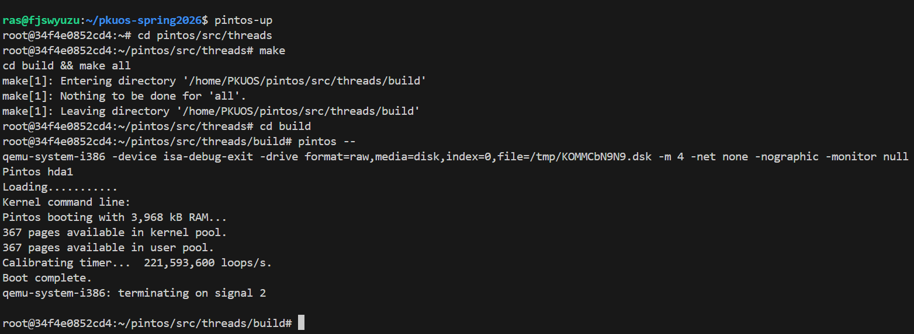
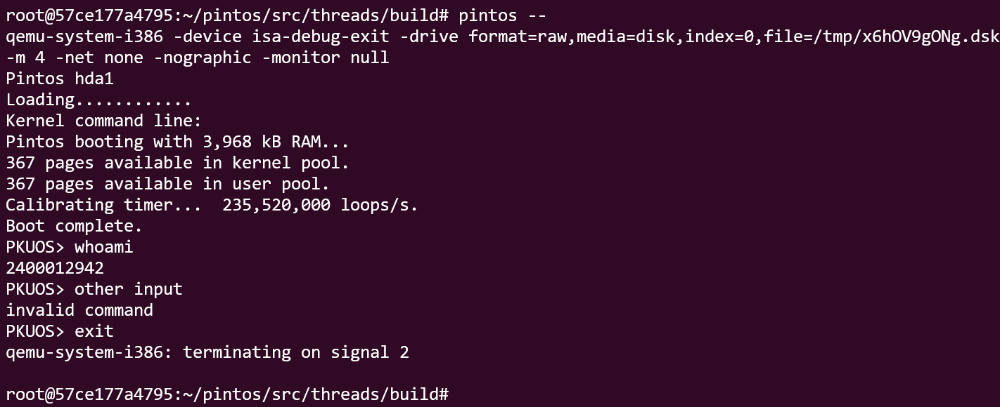

# Project 0: Getting Real

## Preliminaries

>Fill in your name and email address.

Junshi Liu (刘君实) <shshshsh@stu.pku.edu.cn>

>If you have any preliminary comments on your submission, notes for the TAs, please give them here.

可能没有？

>Please cite any offline or online sources you consulted while preparing your submission, other than the Pintos documentation, course text, lecture notes, and course staff.

有很多东西问了大模型。

## Booting Pintos

>A1: Put the screenshot of Pintos running example here.



## Debugging

#### QUESTIONS: BIOS 

>B1: What is the first instruction that gets executed?

`ljmp   $0x3630,$0xf000e05b`

>B2: At which physical address is this instruction located?

0xffff0

#### QUESTIONS: BOOTLOADER

>B3: How does the bootloader read disk sectors? In particular, what BIOS interrupt is used?

在 `read_sector` 中，首先保存所有的通用寄存器，然后在栈上构建数据包，往 `%ah` 寄存器中传入 `0x42` 表示使用 extended read（扩展读）功能，然后调用 BIOS 中断 0x13（`int $0x13`），最后恢复寄存器并保留 flags。

>B4: How does the bootloader decides whether it successfully finds the Pintos kernel?

对于每个驱动（drive），先通过 `cmpw $0xaa55, %es:510` 检查其是否是分区硬盘（partitioned hard disk），原理是检测其是否有 MBR 签名。对于每个分区硬盘，遍历其每个分区，并在 `check_partition` 中使用三条语句 `cmpl $0, %es:(%si)`、`cmpb $0x20, %es:4(%si)` 和 `cmpb $0x80, %es:(%si)`，分别判断这个分区是否是空分区，是否是包含 Pintos kernel 的分区，以及是否是可引导的分区。只有非空的，包含 Pintos Kernel 且可引导的分区才认为找到了 Pintos kernel。

>B5: What happens when the bootloader could not find the Pintos kernel?

输出字符串 `"\rNot found\r"`，并且调用 BIOS 中断 0x18（`int $0x18`）。

>B6: At what point and how exactly does the bootloader transfer control to the Pintos kernel?

此时，内核已经被加载到 0x20000 的位置。具体的入口地址要读取 ELF 头里面取出来（`mov %es:0x18, %dx`）。然后使用 `ljmp *start` 指令进行长跳转，将控制权交给了内核。

#### QUESTIONS: KERNEL

>B7: At the entry of pintos_init(), what is the value of expression `init_page_dir[pd_no(ptov(0))]` in hexadecimal format?

0x0.

```gdb
(gdb) p/x init_page_dir[pd_no(ptov(0))]
=> 0xc000efef:  int3
=> 0xc000efef:  int3
$1 = 0x0
```

>B8: When `palloc_get_page()` is called for the first time,

>> B8.1 what does the call stack look like?

```gdb
Breakpoint 2, palloc_get_page (flags=(PAL_ASSERT | PAL_ZERO)) at ../../threads/palloc.c:113
(gdb) bt
#0  palloc_get_page (flags=(PAL_ASSERT | PAL_ZERO)) at ../../threads/palloc.c:113
#1  0xc00203aa in paging_init () at ../../threads/init.c:168
#2  0xc002031b in pintos_init () at ../../threads/init.c:100
#3  0xc002013d in start () at ../../threads/start.S:180
```

>> B8.2 what is the return value in hexadecimal format?

0xc0101000.

```gdb
(gdb) finish
Run till exit from #0  palloc_get_page (flags=(PAL_ASSERT | PAL_ZERO)) at ../../threads/palloc.c:113
=> 0xc00203aa <paging_init+17>: add    $0x10,%esp
0xc00203aa in paging_init () at ../../threads/init.c:168
Value returned is $2 = (void *) 0xc0101000
```

>> B8.3 what is the value of expression `init_page_dir[pd_no(ptov(0))]` in hexadecimal format?

0x0.

```gdb
(gdb) p/x init_page_dir[pd_no(ptov(0))]
=> 0xc000ef8f:  int3
=> 0xc000ef8f:  int3
$3 = 0x0
```

>B9: When palloc_get_page() is called for the third time,

>> B9.1 what does the call stack look like?

```gdb
(gdb) bt
#0  palloc_get_page (flags=PAL_ZERO) at ../../threads/palloc.c:113
#1  0xc0020a81 in thread_create (name=0xc002e895 "idle", priority=0, function=0xc0020eb0 <idle>, aux=0xc000efbc) at ../.
./threads/thread.c:178
#2  0xc0020976 in thread_start () at ../../threads/thread.c:111
#3  0xc0020334 in pintos_init () at ../../threads/init.c:119
#4  0xc002013d in start () at ../../threads/start.S:180
```

>> B9.2 what is the return value in hexadecimal format?

0xc0103000.

```gdb
(gdb) finish
Run till exit from #0  palloc_get_page (flags=PAL_ZERO) at ../../threads/palloc.c:113
=> 0xc0020a81 <thread_create+55>:       add    $0x10,%esp
0xc0020a81 in thread_create (name=0xc002e895 "idle", priority=0, function=0xc0020eb0 <idle>, aux=0xc000efbc) at ../../th
reads/thread.c:178
Value returned is $1 = (void *) 0xc0103000
```

>> B9.3 what is the value of expression `init_page_dir[pd_no(ptov(0))]` in hexadecimal format?

0x102027.

```gdb
(gdb) p/x init_page_dir[pd_no(ptov(0))]
=> 0xc000ef4f:  int3
=> 0xc000ef4f:  int3
$2 = 0x102027
```

## Kernel Monitor

>C1: Put the screenshot of your kernel monitor running example here. (It should show how your kernel shell respond to `whoami`, `exit`, and `other input`.)



>C2: Explain how you read and write to the console for the kernel monitor.

写一个无限循环读取字符，如果不是换行符则直接输出（因为 Windows 下换行输入到 wsl bash 也是 `\r\n` 所以程序也检测了 `\r`）并保存下当前的字符，否则判断输入的字符是否组成 `whoami` 或 `exit`，然后按照预设的逻辑输出。输出直接使用 C 的标准输入输出库的函数。

这里还多支持了退格符的输入。